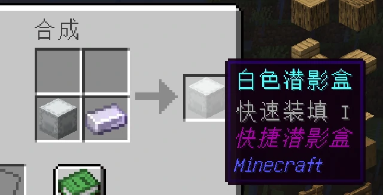

# 2025年6月8日更新：快捷潜影盒改动

现在不使用 `/fsb` 指令来升级潜影盒了，而是通过合成配方。

合成方法，无序合成：快捷潜影盒升级核心 + 普通潜影盒（可以带颜色） = 快捷潜影盒

快捷潜影盒升级核心的获取：电池商店购买，使用 `/coins buy 快捷潜影盒升级核心` 指令

> [!WARNING] 无法合成
> 注意合成快捷潜影盒时需要先清空里面的物品，否则无法合成。

## 其他更新

1. 修复小bug若干

2. 正在重新实现一个全新的称号系统，所以现在称号全部失效，只有萌新称号。